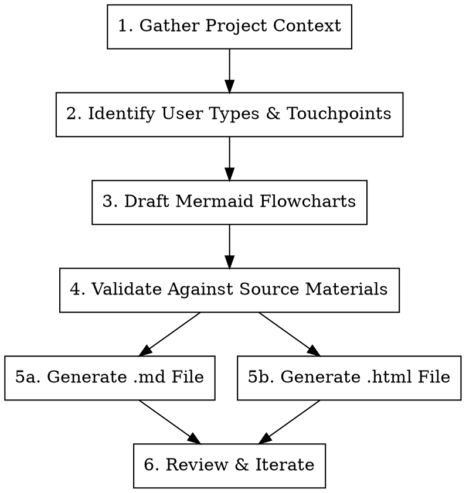

# Creating User Flows

## Overview

User flows are visual diagrams that map how users navigate through an application. This skill produces **two deliverables per flow**: a Markdown file (for documentation context and version control) and an HTML file (for polished client presentations). Both use Mermaid.js for flowcharts.

**REQUIRED:** Use `superpowers:brainstorming` before starting to explore user intent and requirements.
**REQUIRED:** Use `superpowers:subagent-driven-development` to parallelize flow creation across multiple user types.

## Process



### Step 1: Gather Project Context

Read these files in the project directory (in order):

1. `CLAUDE.md` — Full project context, tech stack, constraints
2. `SCOPE_AGREEMENT.md` — What's in/out of MVP scope
3. `MEETING_LOG.md` or `meetings/MEETING_LOG.md` — Client discussions, decisions
4. Any files in `1-Discovery/deliverables/` — Research, technical architecture
5. Client-provided materials (requirements docs, blueprints, questionnaires)

Extract:

- User types (e.g., customer, vendor, admin)
- Key actions each user performs
- Conditional logic ("checkout requires account verification")
- System behaviors ("failed login triggers lockout after 3 attempts")
- Ethical/legal constraints
- Client preferences for UX

### Step 2: Identify User Touchpoints

For each user type, document:

- **Entry point** (sign up, login, landing page)
- **Core actions** they perform
- **Decision points** and branches
- **Exit points**
- **Interactions with other user types**

Focus on what the client described, not assumptions. If something wasn't discussed, it likely doesn't belong.

### Step 3: Draft Mermaid Flowcharts

Create flowcharts using Mermaid.js `flowchart TD` syntax (top-down, vertical flow).

> **Syntax reference:** Consult `references/mermaid-cheatsheet.md` for node shapes, arrow types, color classes, and subgraph syntax.

**Design principles:**

- Prefer vertical (`TD`) over horizontal (`LR`) — always
- Keep parallel branches short (3 branches that reconverge after 1-2 steps)
- Use descriptive node IDs (`CreateProfile` not `Step3`)
- Keep label text concise (under 6 words)
- Use consistent indentation (4 spaces)
- Add blank lines between logical sections
- Use batch `class NodeId className` at bottom — **never** inline `:::className`
- **Split into multiple diagrams when flow has >8 nodes or complex branching** — consult `references/multi-diagram-patterns.md`

### Step 4: Validate Against Source Materials

Re-read meeting transcripts and verify:

- Every step traces back to source materials
- No features outside MVP scope are included
- Flow represents a single user type's perspective
- Flow matches the client's described user journey

### Step 5: Generate Output Files

**CRITICAL: Always generate BOTH files for each user flow.**

#### 5a. Markdown File (.md)

**Location:** `[ProjectDir]/1-Discovery/deliverables/user-flows/[FlowName].md`

**Naming:** `[Subject]_User_Flow.md` for simple projects, `User_Flows_[ProjectName]_YYYY-MM-DD.md` for comprehensive docs

**Structure:**

````markdown
# [Project Name] - [Flow Name] User Flow

> [One-line description of what this flow covers]

**Created:** YYYY-MM-DD
**Status:** Draft (Discovery Phase)
**Version:** v1

---

## Overview

[2-3 sentences describing the flow scope and the user type]

## Key Workflow Principles

- [Bullet list of important design decisions and constraints]

---

## User Flow Diagram

```mermaid
flowchart TD
    [... mermaid diagram code ...]
```
````

---

## Workflow Steps Breakdown

### Step 1: [Step Name]

[Description of what happens, why, and any conditions]

### Step 2: [Step Name]

[Continue for each major step...]

---

## Design Decisions & Constraints

| Decision   | Rationale                  |
| ---------- | -------------------------- |
| [Decision] | [Why this choice was made] |

---

## Color Legend

| Color  | Meaning                   |
| ------ | ------------------------- |
| Green  | Start/End/Success states  |
| Yellow | Important decision points |
| Orange | Warnings/Alerts           |
| Purple | Special workflows         |
| Red    | Error states              |

---

_Document created during Discovery Phase_
_Last Updated: YYYY-MM-DD_

```

#### 5b. HTML File (.html)

**Location:** `[ProjectDir]/1-Discovery/deliverables/user-flows/[FlowName].html`

**Naming:** `[Subject]-[Type]-v[version].html` (e.g., `Mediator-Onboarding-Flow-v1.html`, `SalesRep-Primary-Intake-v2.html`)

> **Template:** Read `assets/template.html` for the complete Benmore dark theme HTML/CSS. Copy its full `<style>` block and `<script type="module">` block into every generated HTML file.

> **Section structure and card types:** Consult `references/html-structure-guide.md` for required sections, card type selection, and Mermaid dark theme configuration.

**CRITICAL RULES:**
- Use ONLY the 5 defined card types (`.card`, `.feature-card`, `.warning-card`, `.error-card`, `.highlight-card`). Do NOT invent custom card classes like `.email-card` or `.payment-card`.
- Every HTML file must be fully self-contained (inline CSS, CDN scripts, no build step).
- Always include a Color Legend section at the bottom.
- For complex flows, use multi-diagram pattern from `references/multi-diagram-patterns.md`.

### Step 6: Review & Iterate

**Checklist before finalizing:**
- [ ] Every step traces back to meeting transcripts or client materials
- [ ] No features outside MVP scope are included
- [ ] Flow represents a single user type's perspective
- [ ] Flow is primarily vertical (top-down)
- [ ] Horizontal branches are minimal and reconverge quickly
- [ ] Node labels are concise and clear
- [ ] Decision points have clear Yes/No or labeled paths
- [ ] Start and end points are clearly marked
- [ ] Color styling highlights key states
- [ ] If flow has >8 stages or complex branching: split into multiple diagrams (see `references/multi-diagram-patterns.md`)
- [ ] No inline `:::className` notation — batch `class NodeId className` only
- [ ] Both .md and .html files generated
- [ ] .md file has complete mermaid diagram(s) + step descriptions
- [ ] .html file renders correctly with dark theme
- [ ] .html file uses ONLY the 5 defined card types — no custom classes
- [ ] .html file has a Color Legend section
- [ ] Files are in `1-Discovery/deliverables/user-flows/` directory

---

## Examples

### Example 1: Single user type, simple flow

**User says:** "Create user flows for the mediator onboarding in the Pam project"

**Actions:**
1. Read `149-Pam/CLAUDE.md`, `SCOPE_AGREEMENT.md`, `meetings/MEETING_LOG.md`
2. Identify mediator touchpoints: signup → profile creation → verification → dashboard
3. Draft single Mermaid flowchart (under 8 nodes, no split needed)
4. Validate all steps against meeting transcripts
5. Generate `Mediator_User_Flow.md` + `Mediator-Onboarding-Flow-v1.html`

**Result:** Paired .md/.html files in `149-Pam/1-Discovery/deliverables/user-flows/`

### Example 2: Multi-user project with complex flows

**User says:** "Create all user flows for the Latinovation MSD project"

**Actions:**
1. Research agent reads all project docs, identifies 3 user types (Sales Rep, Admin, Back Office)
2. Sales Rep flow has 12 stages → use multi-diagram pattern (overview + 3 detail diagrams)
3. Admin Portal has 3 independent modules → hub-and-spoke split
4. Back Office is linear, under 8 stages → single diagram
5. Parallel agents generate all 3 flows simultaneously
6. Review agent cross-validates all flows against source materials

**Result:** 6 files total (3 .md + 3 .html). Sales Rep and Admin use multi-diagram pattern.

### Example 3: Updating an existing flow

**User says:** "Update the Showplate influencer flow to v2 based on yesterday's meeting"

**Actions:**
1. Read existing `Influencer-Flow.html` to understand current state
2. Read `meetings/MEETING_LOG.md` for new decisions
3. Identify what changed (new steps, removed steps, modified branches)
4. Generate `Influencer-Flow-v2.html` (new version, don't overwrite v1)
5. Update corresponding .md file

**Result:** New v2 files alongside existing v1 for comparison.

---

## Troubleshooting

### Mermaid diagram doesn't render in HTML
**Cause:** Syntax error in flowchart — usually a missing arrow, unclosed subgraph, or special character in node label.
**Solution:** Check for `&`, `(`, `)` in node text — wrap in quotes: `Node["Text with (parens)"]`. Verify every `subgraph` has a matching `end`. Test the Mermaid code in isolation before embedding.

### HTML file looks broken or has no dark theme
**Cause:** Mermaid JS module not loading or `themeVariables` config missing.
**Solution:** Ensure the `<script type="module">` block uses the exact import URL and full `themeVariables` object from `references/html-structure-guide.md`. Check that `<style>` block includes all card type CSS from `assets/template.html`.

### Flow is too complex or unreadable
**Cause:** Too many nodes in a single diagram (>8 stages or 2+ decision branches).
**Solution:** Apply multi-diagram pattern from `references/multi-diagram-patterns.md`. Split into overview + detail diagrams.

### Card type drift in HTML output
**Cause:** Inventing custom CSS classes (e.g., `.email-card`, `.payment-card`, `.admin-card`).
**Solution:** Use ONLY the 5 defined card types. Map content to the closest semantic match using the decision tree in `references/html-structure-guide.md`.

### Colors don't show in Mermaid diagram
**Cause:** Using inline `:::className` notation instead of batch `class` statements.
**Solution:** Always define `classDef` lines and apply with `class NodeA,NodeB className` at the bottom of the diagram. Never use `:::`.

### Flow includes features not discussed by client
**Cause:** Adding assumptions or edge cases not in source materials.
**Solution:** Re-read Step 4 validation. Every node must trace to a meeting transcript, scope document, or client-provided material. If it wasn't discussed, remove it.

---

## Subagent Parallelization Strategy

When a project has multiple user types, use agent swarms:

1. **Research agent** — Reads all project docs, extracts user types and touchpoints
2. **One agent per user flow** — Each generates both .md and .html for their assigned flow
3. **Review agent** — Validates all flows against source materials

Example task breakdown for a 3-user-type project:
- Task 1: Research & extract all user types and touchpoints (blocks 2-4)
- Task 2: Generate User Type A flow (.md + .html)
- Task 3: Generate User Type B flow (.md + .html)
- Task 4: Generate User Type C flow (.md + .html)
- Task 5: Cross-validate all flows against source materials
```
