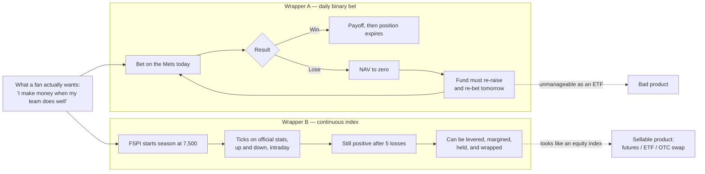
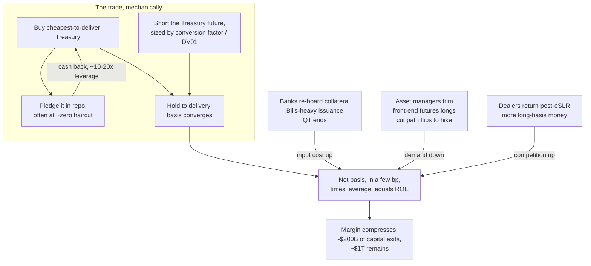
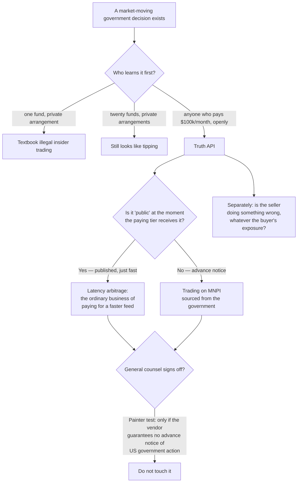
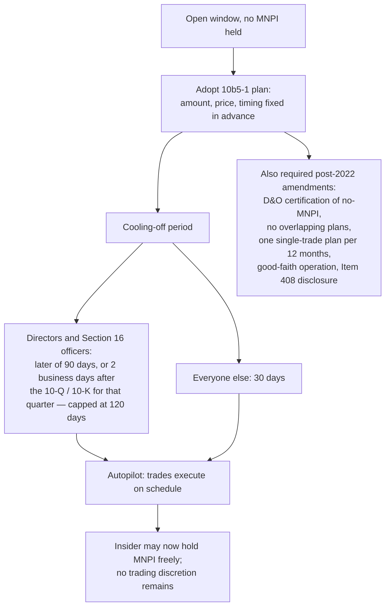
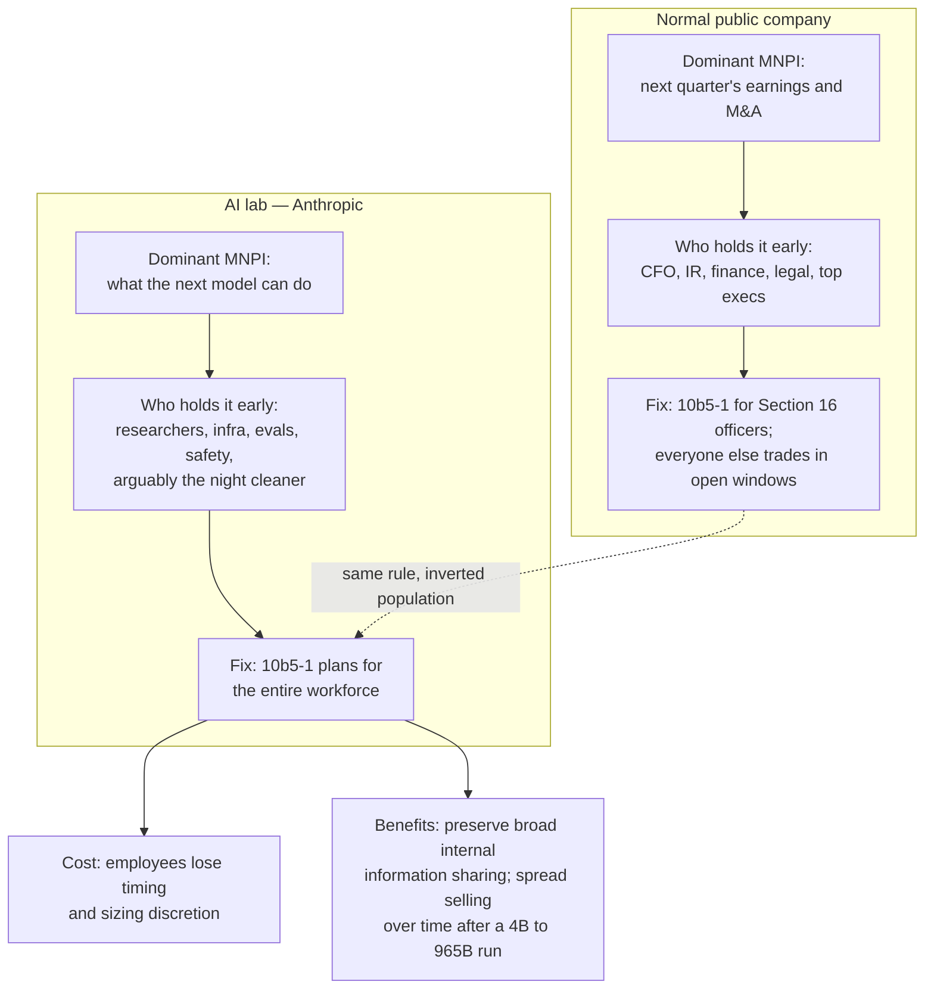

## TL;DR

One column, four movements, one shared shape: **a payoff that is awkward to own gets re-manufactured into a payoff that is easy to own, and the interesting question is always who pays for the manufacturing.**

- **Sports** — a binary bet is a bad wrapper; a continuous index is a good one. FutureSports manufactures the second out of the first.
- **Basis trade** — Treasury bonds are a bad wrapper for rates exposure if you already own cash credit; futures are a good one. Hedge funds manufacture the second out of the first, and this month the factory margin collapsed.
- **Truth API** — private inside information is an illegal wrapper; a paid subscription feed is a legal-ish one. Trump Media is manufacturing the second out of the first.
- **10b5-1** — discretionary selling by an informed employee is an illegal wrapper; a preset schedule is a legal one. Anthropic is considering manufacturing the second for its whole workforce.

---

<div id="ms-sports-happen-so-much"></div>

## Money Stuff — Sports Happen So Much

**[Read on Bloomberg ↗](https://www.bloomberg.com/opinion/newsletters/2026-07-23/sports-happen-so-much)** · _Money Stuff_, Matt Levine, July 23 2026

### 1 · The joke-to-product pipeline

The column opens on Levine's recurring observation about his own causal power over financial products. He joked about a prediction-market index — passive exposure to the market portfolio of probabilities, "events have become more likely" — and then reality complied twice.

```
LEVINE'S LAW OF FINANCIAL-PRODUCT GENESIS
═══════════════════════════════════════════════════════════════════
  Day 0        Levine makes a dumb joke in Money Stuff
                 │
  Day 1        ├──► a reader emails "I did that thing"     (also a joke)
                 │
  Month 1–2    └──► a real firm launches it, dead-eyed and earnest
                       │
                       ├─ "sports gambling ETF" (predicted 2025)
                       │     └─► Subversive All Season Sports ETF
                       │         485APOS filed Jul 9 2026, Tidal Trust I
                       │
                       └─ "prediction-market index" (joked Jun 2026)
                             └─► FutureSports launches Jul 23 2026
                                 (not quite an index of probabilities —
                                  an index of *what happened*)
```

### 2 · What an FSPI actually is

FutureSports is set up as an **independent index administrator**, not a sportsbook and not an exchange. It converts officially reported statistics into continuously updating index values.

```
FUTURESPORTS PERFORMANCE INDEX (FSPI) — HOW A TEAM BECOMES A PRICE
═══════════════════════════════════════════════════════════════════════
 PRE-SEASON            IN-GAME (real time)              PRODUCT LAYER
 ──────────            ───────────────────              ─────────────
 base = 7,500  ──►  official play-by-play feed  ──►  listed futures
      │                    │                          ETFs
      │                    ├─ wins / margin      (+)  OTC swaps
      │ reset every        ├─ scoring events     (+)
      │ season             ├─ leading at half    (+ vs prev close)
      │                    ├─ star-player injury (−)
      │                    └─ "unanticipated
      │                        behaviour issues" (−)
      │
      └─ the load-bearing design choice:
         the index NEVER PRINTS ZERO.
         Lose five straight and there is still a positive
         value → there is still money in the wrapper.
```

Levine's framing of why this matters is the sharpest thing in the section, and it is a product-structuring point, not a markets point:

> Traditional sports betting is binary (you make money if your team wins and lose your bet if it loses), which is fun and a good gambling user experience but bad for long-term financial products. Turning a series of binary sports bets into a single continuous number is good for selling financial products.



The Subversive fund is the counter-example that makes the point. It is an **actively managed, diversified** sports-gambling ETF — exposure to 40–80 concurrent event contracts on Kalshi and Polymarket, trying to generate alpha where the market's odds are wrong. That gives you uncorrelated returns and dark comedy. It does not give you "I make money when the Hurricanes score."

```
WHAT THE FAN WANTS vs WHAT THE THREE PRODUCTS DELIVER
═══════════════════════════════════════════════════════════════════════
                         team-linked?  survives a loss?  manageable fund?
 ──────────────────────  ────────────  ────────────────  ────────────────
 Sportsbook / Kalshi
   single-game bet            YES            NO                n/a
 Subversive All Season
   Sports ETF (active)        NO             YES               YES
 ETF on one team's FSPI       YES            YES               YES   ◄── the gap
                                                                       being filled
```

### 3 · The hedging pitch, and why Levine doesn't buy it

The press release's stated market is risk transfer: broadcasting partners, sponsors, insurers, stadium operators, lenders, apparel makers, hedging "weather events, to injuries, to unanticipated behavior issues" against a $650B global sports industry. Levine's objection is basis risk, and it is the correct objection.

```
SPORTS HEDGING — THE BASIS-RISK LADDER
═══════════════════════════════════════════════════════════════════════
 EXPOSURE YOU ACTUALLY HAVE          HEDGE ON OFFER            BASIS RISK
 ──────────────────────────          ──────────────            ──────────
 bar's beer sales                ◄─  short the local team         HIGH
   wins → playoff hopes → foot        (non-linear, lagged,
   traffic → pints                     weather-confounded)

 club revenue if relegated       ◄─  short own promotion odds     MEDIUM
   (cliff-edge, so closest to a       (the textbook good case)
    real hedge)

 sponsor / endorser brand value  ◄─  short "conduct issues"        HIGH
   (idiosyncratic, discontinuous,     (does the index even
    reputational not statistical)      encode this?)

 broadcaster ad inventory        ◄─  short "games get boring"      ???
 stadium F&B / parking           ◄─  short attendance-linked stats ???
 ───────────────────────────────────────────────────────────────────────
 FSPI's claim: collapse ALL of these onto ONE continuous number.
 Levine's counter: collapsing is not correlating. An index that tracks
 nobody's P&L exactly is a NEW basis risk, not a hedge for the old one —
 and daily betting on the games may hedge the bar better than the index.
```

**My read, beyond the column.** The regulatory shape of the thing is the part the press release doesn't say out loud. Look at who they hired: an ex-ICE COO as chairman, a CME Group product head on the board, index leadership out of S&P Dow Jones Indices and FTSE Russell, and regulatory affairs run by a former CFTC chief of staff — with CME Ventures co-leading the seed. That is not a hedging-startup cap table; that is **an index administrator buying a listed-futures distribution path.** And a _broad-based statistical index_ future is a materially easier CFTC conversation than a binary contract on the outcome of a single contest, which is precisely the fight prediction markets have been having. Framing it as an index does two jobs at once: it fixes the ETF-wrapper problem _and_ it moves the product out of the "gaming" bucket. The hedging story in the press release is the part that has to be there for the filing, not the part that has to be true.

### 4 · The composite index Levine actually wanted

The bit that stayed with me. He wanted a **Composite Sports Index** — a single number for whether sports happened more today than yesterday.

```
THE COMPOSITE SPORTS INDEX (does not exist; should)
═══════════════════════════════════════════════════════════════════════
      runs + goals + touchdowns + points + knockouts + birdies
      ─────────────────────────────────────────────────────────  × k
                        games played

   commentary:  "Sports are up 40 bps today on strong scoring."
                "Sports fell into the close on defensive discipline."
   sign conventions unresolved:
      strikeouts        → good? bad?
      attendance        → in the numerator?
      bench-clearing brawls → presumably a drawdown
   use case:  institutions hedge the risk of sports happening less.
```

---

### 5 · People are worried about the basis trade

Levine's model of the trade — the one worth internalising — is not "hedge funds spot mispricings." It is **manufacturing**.

```
THE WIDGET-FACTORY MODEL OF THE BASIS TRADE
═══════════════════════════════════════════════════════════════════════
 RAW MATERIAL                FACTORY                    CUSTOMER
 ────────────                ───────                    ────────
 Treasury bonds  ─────────►  hedge fund      ─────────► asset managers
 (cash CTD issue)            · buy cash bond            · already own
       │                     · short the future           cash corporate
       │                     · repo-finance the bond      credit
       │                     · 10–20× leverage          · want rates
       │                            │                     duration on top
       │                            ▼                    · so they BUY
       │                  revenue  = futures richness      futures
       │                  cost     = repo + haircut      · futures do not
       │                  margin   = the spread            occur in nature
       │                            │
       └─ inputs must be cheap ─────┘
          and plentiful

 Framing consequence: a durable low-vol return is a SERVICE FEE, not a
 free lunch. You are being paid your cost of capital for running a
 factory. Same model explains index-rebalance, dispersion, and shorting
 into lockup expiries.
```

Three ways a factory dies. In July 2026 the Bloomberg reporting says all three are happening simultaneously.

```
THE 2026 SQUEEZE — ALL THREE INPUTS AT ONCE
═══════════════════════════════════════════════════════════════════════
 1  INPUT COST ↑     banks re-hoarding Treasuries after years of lean
                     balance sheets (eSLR recalibration: final rule
                     Nov 25 2025, effective Apr 1 2026, voluntary from
                     Jan 1 2026) · issuance tilting toward bills ·
                     Fed no longer shrinking its balance sheet
                     ────► collateral scarcer and richer

 2  DEMAND ↓         asset managers trimming long front-end Treasury
                     futures (CFTC positioning) · post-Iran-escalation
                     the Fed path flipped from CUTS to a possible HIKE
                     ────► futures trade less rich to cash
                           ────► less premium to harvest

 3  COMPETITION ↑    dealers back in size on the same deregulation ·
                     more long-basis money chasing the same few bp
                     ────► margin per widget → 0

 SCOREBOARD
 ══════════
 Morgan Stanley  capital in leveraged cash-Treasury basis positions
                 DOWN >$200B in recent months → ~$1T
 Goldman (repo)  clients "bemoaning that the basis is 'dead'"
                                          — Chris Horvatin, MD
 Morgan Stanley  "at some point the returns in this trade become less
   (rates)       attractive as you have more and more money entering
                 into long basis positions"      — Eli Carter
```



---

### 6 · Truth API and the insider-trading continuum

Trump Media is selling low-latency access to posts from Trump and nine other top accounts — top tier around **$100,000 a month** ($60k with a three-year commitment), launching August 1, with several high-frequency firms reportedly already signed. The precedent for why anyone would pay: the April 9 2025 tariff-pause post moved index futures within minutes.

Levine uses it to re-run his favourite unanswerable question. Start from the two ways to monetise a secret you got from an insider.

```
ONE SECRET, TWO EXITS
═══════════════════════════════════════════════════════════════════════
   You befriend an insider and learn something material and nonpublic
                              │
        ┌─────────────────────┴─────────────────────┐
        ▼                                           ▼
   TRADE THE STOCK                          PUBLISH IT AND
   before it's public                       CHARGE FOR ACCESS
        │                                           │
   = insider trading                         = journalism
   = generally illegal                       = generally fine
        │                                           │
        └────────────► and in between: ◄────────────┘
              sell it to 1 fund … 5 funds …
              a "newsletter" with 10 subscribers
              at $100k/month each
```

The continuum, with Levine's explicitly-vibes-only guess at where the line sits:

```
FROM INSIDER TRADING TO JOURNALISM — ONE AXIS, NO BRIGHT LINE
═══════════════════════════════════════════════════════════════════════
 subscribers    1        3        10       ~100      500      1,000,000
 price / yr    $10M     $10M     $1.2M    ~$100k    $10k       $49.95
                │        │        │         │         │           │
                ▼        ▼        ▼         ▼         ▼           ▼
        ┌────────────────────────────┬───────────┬─────────────────────┐
        │     INSIDER TRADING        │ ??? LINE  │     JOURNALISM      │
        │  "surely a crime"          │  ???      │  "surely fine"      │
        └────────────────────────────┴───────────┴─────────────────────┘
                                     ▲
                          Levine's gut: the line is near
                          ~100 subscribers and ~$100k/yr.
                          No statute says this. He flags four
                          separate times that it is not advice.

 TRUTH API SITS HERE:  price $1.2M/yr  ·  subscribers: anyone who pays
                       → high on the price axis, unbounded on the count
                       → and the insider is THE UNITED STATES GOVERNMENT
```



The Painter test in the column is the operationally useful line — a general counsel should say _don't touch this unless Truth Social guarantees there will be no advance notice of any post containing information about US government action._ Note the asymmetry Levine keeps returning to: the **seller** of a company's secrets is obviously breaching duties (fire them, sue them, maybe prosecute them), while the **subscribers** have a genuinely decent "it was published, we subscribed" answer. Openness fixes the buyer's problem and does nothing at all for the seller's.

Meanwhile the plumbing is fully built out already: firms scan the feed for keywords (`ceasefire`, `Iran`, "Thank you for your attention to this matter"), run agents to grade market impact, and act in a fraction of a second — in a business where a nanosecond is about a foot of light.

---

### 7 · 10b5-1 plans, and the Anthropic inversion

The standard architecture for letting insiders sell at all:

```
THE STANDARD INSIDER-SELLING ARCHITECTURE
═══════════════════════════════════════════════════════════════════════
 ├─ earnings released ──────────────────────────────────────► OPEN WINDOW
 │     polite fiction: everything material is now disclosed
 │
 ├─ quarter progresses ─────────────────────────────────────► BLACKOUT
 │     employees accrete knowledge of results the market lacks
 │
 ├─ OVERRIDE, always: if you actually hold MNPI, you cannot sell,
 │     open window or not (GC who learns of a breach: no.)
 │
 └─ BEST PRACTICE for executives: adopt a 10b5-1 plan while clean
       "sell 10,000 shares monthly starting next year"
       "sell 100,000 shares if it trades above $100"
       → then go generate inside information all day without
         it touching your trading
```



Then the inversion, which is the whole point of the Anthropic story. The blackout-window machinery assumes the dominant MNPI is **next quarter's earnings** and that it lives in **finance**. At an AI lab, neither holds.



```
WHY THE EARNINGS-SHAPED RULEBOOK MISFITS AN AI LAB
═══════════════════════════════════════════════════════════════════════
 assumption in the standard model         reality at a frontier lab
 ───────────────────────────────────      ─────────────────────────
 MNPI arrives quarterly, on a calendar    arrives whenever a training
                                          run finishes — no calendar

 MNPI is financial                        MNPI is capability + safety
                                          findings + one big eval

 seniority correlates with knowing        an IC researcher knows first;
                                          the CFO reads about it later

 an open window means "clean"             there is no clean window if the
                                          model shipped a step-change
 ───────────────────────────────────────────────────────────────────────
 → so you cannot solve it with windows. You solve it by removing
   discretion from everybody: 10b5-1 for all. Reported as under
   consideration only; would not replace the standard IPO lockup.
```

Levine's version of the argument is funnier and lands in the same place: the night cleaning person who meets the newly sentient model has better inside information than any finance executive closing the quarter's books. So — plans for everyone.

---

## Domain deep-dive — the mechanics the column assumes you know

### The Treasury cash-futures basis, properly

The trade Levine calls widget manufacturing has a precise anatomy.

```
ANATOMY OF THE LONG-BASIS TRADE
═══════════════════════════════════════════════════════════════════════
 DEFINITIONS
   gross basis        = cash price − (futures price × conversion factor)
   carry              = coupon accrual − repo financing cost
   net basis (BNOC)   = gross basis − carry     ← what you actually earn
   implied repo rate  = the financing rate that makes the trade break even
   trade is on when   IRR > actual term repo rate
   CTD                = the deliverable issue that maximises the short's
                        delivery economics; the short owns a delivery
                        option (which issue, which day in the month), so
                        a "converged" basis is never quite risk-free
   hedge ratio        = conversion factor, i.e. DV01-matched, not 1:1

 P&L IDENTITY
   return ≈ (net basis, a few bp annualised) × (leverage, 10–20×)
            − haircut drag − margin-call financing

 WHY LEVERAGE IS THE WHOLE TRADE
   A 2–5 bp edge is nothing unlevered. Repo haircuts on Treasuries run
   very low — the OFR/Fed work on hedge-fund repo found the large
   majority of hedge-fund repo borrowing done at zero or negative
   haircuts — so the position is capital-light until haircuts rise or
   funding gets scarce. That is also the fragility: the deleveraging
   channel is a haircut/margin shock, not a directional rates view.

 THE SYSTEMIC FILE
   CFTC data had leveraged-fund shorts in 2/5/10y futures above $1T in
   March 2025. Fed/OFR notes quantify the cash-futures positions; the
   Dallas Fed has written on hedge-fund leverage affecting monetary-policy
   implementation. SEC's Treasury clearing rule pulls cash Treasury
   trades into central clearing (late 2026) and Treasury repo (mid-2027)
   — i.e. the plumbing under this trade is itself being re-piped.
```

Note how neatly the widget-factory model maps onto the actual variables: **input cost = repo rate + collateral scarcity**, **product price = futures richness (IRR minus repo)**, **competition = how much long-basis capital is chasing the same CTD**. When Bloomberg reports bills-heavy issuance, the end of QT, and dealers returning post-eSLR, those are not three anecdotes — they are the three terms of that expression moving the wrong way together.

### What it would actually take to trade an FSPI

The press release's product list — listed derivatives, ETFs, OTC swaps — is three very different regulatory animals wearing one sentence.

```
FSPI PRODUCT STACK — WHAT EACH LEG REQUIRES
═══════════════════════════════════════════════════════════════════════
 LAYER 0 · BENCHMARK ADMINISTRATION
   IOSCO Principles for Financial Benchmarks (2013) are the global
   baseline: governance, methodology transparency, control over
   discretion, data sufficiency, audit trail. In the EU, BMR
   authorisation. Practical question nobody has answered yet: the
   INPUT is a league's own officially reported box score. Whose
   scorer's discretion is now a settlement price? A stat correction
   three days later is a benchmark restatement.

 LAYER 1 · LISTED FUTURES (a DCM lists them, CFTC oversight)
   Contract self-certification, position limits, settlement procedure,
   and the live question of whether a sports-linked contract trips the
   event-contract / "gaming" review. A broad-based statistical index is
   a much better argument here than a binary on one contest — which is
   plausibly the real reason for the index framing.

 LAYER 2 · ETF (1940 Act wrapper on top of Layer 1)
   The fund needs something *investable* to hold. An index is not
   investable; futures on the index are. So Layer 1 must exist and be
   liquid first, or the ETF is holding swaps and hitting derivatives
   limits. This is exactly why FutureSports leads with index futures.

 LAYER 3 · OTC SWAP (bilateral total-return swap on the index)
   ISDA Master + CSA · uncleared, so BCBS-IOSCO margin applies:
   daily variation margin, and initial margin (ISDA SIMM, calibrated
   to a 99th-percentile 10-day move) once above threshold.
   The dealer's real problem is the hedge: it is short a continuous
   index whose only hedging instruments are the listed future (if it
   exists) or a book of individual game bets. If the future is thin,
   the dealer is warehousing sports risk and charging for it.
```

That last box is the honest answer to Levine's "would it actually hedge anything?" question. **Someone has to be on the other side.** For an equity index the natural other side is a hedger with the opposite exposure. For the Carolina Hurricanes Index, the natural other side is… fans, and a dealer who will only quote it if it can lay the risk off into game-by-game markets. Which means the index price is ultimately a repackaging of the same sportsbook lines it was supposed to improve on — with an extra layer of methodology risk on top.

```
THE CIRCULARITY
═══════════════════════════════════════════════════════════════════════
 bar wants to hedge beer sales
      │
      ▼
 buys FSPI-linked ETF ──► ETF holds FSPI futures ──► dealer/market maker
                                                          │
                                                    hedges by … betting
                                                    on the games
                                                          │
                                                          ▼
                                          the same binary sportsbook
                                          market the bar could have
                                          used directly, plus fees,
                                          plus index methodology risk
 ───────────────────────────────────────────────────────────────────────
 The wrapper is genuinely better (continuous, holdable, marginable).
 The HEDGE is not obviously better. Levine is right on the second point
 and generous on the first, and both can be true at once.
```

---

## Sources

- Matt Levine, **"Sports Happen So Much"**, _Money Stuff_, Bloomberg Opinion, [Jul 23 2026](https://www.bloomberg.com/opinion/newsletters/2026-07-23/sports-happen-so-much) · prior columns referenced: ["Sports Gambling ETF", Jul 10 2026](https://www.bloomberg.com/opinion/newsletters/2026-07-10/sports-gambling-etf)
- Greg Ritchie, **"Hedge Funds' Favorite US Bond Trade Is Sputtering"**, [Bloomberg, Jul 23 2026](https://www.bloomberg.com/news/articles/2026-07-23/hedge-funds-favorite-us-bond-trade-is-sputtering) · [Hedgeweek summary](https://www.hedgeweek.com/hedge-funds-1tn-treasury-basis-trade-shows-signs-of-losing-momentum/)
- **FutureSports launch release**, [PR Newswire, Jul 23 2026](https://www.prnewswire.com/news-releases/futuresports-launches-as-new-index-provider-transforming-sports-statistics-into-tradable-financial-instruments-302832829.html) · [seed round detail, Alternatives Watch](https://www.alternativeswatch.com/2026/07/23/futuresports-seed-round-marquee-cme-sports-index/)
- **Subversive All Season Sports ETF / Subversive Prediction ETF**, 485APOS filed [Jul 9 2026, SEC EDGAR](https://www.sec.gov/Archives/edgar/data/1742912/000199937126014651/subversive-485apos_070926.htm)
- **Truth API pricing and launch**, [CNBC, Jul 18 2026](https://www.cnbc.com/2026/07/18/trump-media-pitched-100000/month-fee-for-fastest-feed-of-trump-posts.html)
- **Anthropic firm-wide 10b5-1 consideration**, [The Information, Jul 23 2026](https://www.theinformation.com/articles/anthropic-considers-unusual-plan-employee-stock-sales-goes-public) · [Reuters pickup](https://finance.yahoo.com/markets/stocks/articles/anthropic-mulls-mandatory-employee-stock-141206883.html)
- **Rule 10b5-1 mechanics**: SEC [fact sheet, Release 33-11138](https://www.sec.gov/files/33-11138-fact-sheet.pdf) · [Skadden](https://www.skadden.com/insights/publications/2022/12/sec-amends-rules-for-rule-10b51-trading-plans-and-adds-new-disclosure-requirement) · [Greenberg Traurig](https://www.gtlaw.com/en/insights/2023/1/sec-adopts-final-amendments-to-rule-10b5-1-and-new-disclosure-requirements)
- **Basis-trade mechanics and size**: [CFTC MRAC briefing on the Treasury cash-futures basis trade](https://www.cftc.gov/media/11671/mrac121024_TreasuryCashFuturesBasisTrade/download) · [Fed FEDS Note, quantifying basis trades](https://www.federalreserve.gov/econres/notes/feds-notes/quantifying-treasury-cash-futures-basis-trades-20240308.html) · [OFR WP 21-01, hedge funds and the cash-futures disconnect](https://www.financialresearch.gov/working-papers/files/OFRwp-21-01-hedge-funds-and-the-treasury-cash-futures-disconnect.pdf) · [Dallas Fed on hedge-fund leverage and policy implementation](https://www.dallasfed.org/research/economics/2026/0528)
- **eSLR recalibration**: [Federal Reserve final rule announcement, Nov 25 2025](https://www.federalreserve.gov/newsevents/pressreleases/bcreg20251125b.htm) · [OCC Bulletin 2025-41](https://www.occ.gov/news-issuances/bulletins/2025/bulletin-2025-41.html)
- **Benchmark and OTC plumbing**: [IOSCO Principles for Financial Benchmarks](https://www.iosco.org/library/pubdocs/pdf/IOSCOPD415.pdf) · [ISDA collateral / uncleared margin practice](https://www.isda.org/collateral-management-sop/)

---

## What's next week

Watching two things out of this column. First, whether FutureSports names an exchange and a league partner — that is the tell for whether Layer 1 (listed futures) is real or whether this stays an index-licensing business. Second, whether the basis-trade capital that left shows up somewhere adjacent: if the widget factory model is right, that $200B does not retire, it goes looking for another manufacturing spread.
